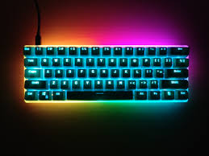

---?image=assets/image/ivan_televnyy.jpg

# フロントエンド

---?image=assets/image/lukas_blazek.jpg

この話は「JavaScript」を使ってるのでフロントエンドです。

※ 異論は認めない

---?image=assets/image/lukas_blazek.jpg

## この話の対象者

+++?image=assets/image/lukas_blazek.jpg

社内のエンジニア向けのスライドです。

エンジニア以外の方が聞いても大丈夫ですが
ﾁﾝﾌﾟﾝｶﾝﾌﾟﾝになると思います。

---?image=assets/image/lukas_blazek.jpg

## 今回話さないこと

Vue.jsの詳細については話しません。

知りたい方は別途学習してください。

---?image=assets/image/lukas_blazek.jpg

## what's Vue Native?

+++?image=assets/image/lukas_blazek.jpg

Vue.jsのシンタックスでネイティブアプリが開発できます。

React Nativeと似た者同士。

+++?image=assets/image/lukas_blazek.jpg

（適当に）噛み砕くなら

「HTML、JS、CSSだけでネイティブアプリが作れる」

+++?image=assets/image/lukas_blazek.jpg

### メリット

- フロントエンドエンジニアでもアプリが作れる
- 使っている技術がHTML、JS、CSSなので学習コストが他に比べて格段に低い
- vimでも開発できる（重要）

+++?image=assets/image/lukas_blazek.jpg

### デメリット

- Vue.js記法なのである程度慣れが必要
- HTML、JS、CSSを知らないと作れない
- vim以外でも開発できてしまう（さして重要ではない）

---?image=assets/image/lukas_blazek.jpg

## Vue Nativeへの期待

+++?image=assets/image/lukas_blazek.jpg

### 本題に入る前に

- Vue Nativeについて調べてきた人？
- Vue Nativeの環境を作ってきた人？
- Vue Nativeでアプリ作ってきた人？
- Vue Nativeの動作原理まで調べてきた人？

+++?image=assets/image/lukas_blazek.jpg

ここまででやってきてたら優秀なエンジニアだと思います。

- Vue Nativeについて調べてきた人？
- Vue Nativeの環境を作ってきた人？
- Vue Nativeでアプリ作ってきた人？ ← ココ
- Vue Nativeの動作原理まで調べてきた人？

---?image=assets/image/lukas_blazek.jpg

エンジニアといえば
キーボードですよね。

---?image=assets/image/maarten_deckers.jpg

# What's Keyboard ?

---?image=assets/image/lukas_blazek.jpg

いくつか種類がある

- メンブレン
- パンダグラフ
- 静電容量無接点方式
- メカニカル

---?image=assets/image/maarten_deckers.jpg

# メンブレン

+++?image=assets/image/lukas_blazek.jpg

## 特徴

- 製造コストが安い
- 押した際のフィードバックが非常に小さい
- 最近では滅多にお目にかかることはなくなってきた

---?image=assets/image/maarten_deckers.jpg

# パンタグラフ

+++?image=assets/image/lukas_blazek.jpg

## 特徴

- パンタグラフ方式のスプリングを採用したキーボード
- 比較的安価に作れる
- 現在のPCのほぼ全てに採用されている（ノート、BTO両方）
- メンブレンに比べて押しやすく打ち間違えが少ない

---?image=assets/image/maarten_deckers.jpg

# 静電容量無接点方式

+++?image=assets/image/lukas_blazek.jpg

## 特徴

- 静電容量の変化で入力を検知する
- 機械接点がないため耐久度が高い
- 基本的に価格が高い

+++?image=assets/image/lukas_blazek.jpg

## 代表製品

- Realforce
- PFU HHK
- PFU Limited Edition

---?image=assets/image/maarten_deckers.jpg

# メカニカル

+++?image=assets/image/lukas_blazek.jpg

## 特徴

- キースイッチが独立している
- 入力時に軽快な音を奏でられる
- 他のキーボードに比べて疲れにくい
- **自作可能**

+++?image=assets/image/lukas_blazek.jpg

## 自作？

キーボードのパーツすべてがパーツ単位で購入可能。
そのため、市販にはないオリジナリティを追求できる。

+++?image=assets/image/lukas_blazek.jpg

## 構成パーツ

- ケース（外側）
- プレート
- PCBボード
- キースイッチ
- キーキャップ
- LED （オプション）

+++?image=assets/image/lukas_blazek.jpg

パーツだけで言ってもこんだけ存在している。

+++?image=assets/image/lukas_blazek.jpg

パーツの数だけオリジナリティが出せる。

+++?image=assets/image/lukas_blazek.jpg

## ケース

- アルミ
- プラスチック

基本この2種類から選択。

+++?image=assets/image/lukas_blazek.jpg

- アルミは見た目はかっこいいが「重い」
- プラスチックは見た目がダサいが「軽く」LEDが透過される

といった一長一短がある。

+++?image=assets/image/lukas_blazek.jpg

アルミケース

+++?image=assets/image/lukas_blazek.jpg

プラスチックケース

+++?image=assets/image/lukas_blazek.jpg

他にも木製やコンクリ製など殺傷能力の高いものもあったりします。

+++?image=assets/image/lukas_blazek.jpg

## プレート

このパーツ自体はPCBボードに差し込むスイッチが動かないようにするためのもの。

これもプラスチックとアルミなどがある。

+++?image=assets/image/lukas_blazek.jpg

色も多彩にあり、キーキャップの間からも見えたりするので、ちょっとオサレにも。

+++?image=assets/image/lukas_blazek.jpg

+++?image=assets/image/lukas_blazek.jpg

+++?image=assets/image/lukas_blazek.jpg

## PCBボード

いわゆるプリント基板だが、サイズ感がたくさんある。

+++?image=assets/image/lukas_blazek.jpg

- 75%サイズ
- 66%サイズ
- 60%サイズ
- 45%サイズ

などなど...

+++?image=assets/image/lukas_blazek.jpg

「45%サイズ」とか本当に使う人がいるのか不明。

大体の人が作っているのが60%〜66%程度のサイズ

+++?image=assets/image/lukas_blazek.jpg

+++?image=assets/image/lukas_blazek.jpg

## キースイッチ

重さや軸の色で「音」や「入力感」が変わる
キーボードのコアと言っても過言ではない

+++?image=assets/image/lukas_blazek.jpg

これでもまだ一部。

全量は[こちら](https://mechanicalkeyboards.com/mechanical_switches.php)

+++?image=assets/image/lukas_blazek.jpg

### なぜコアか？

キーボードは「押す」もので、長時間利用することがほとんどです。

長時間利用するのであれば、「軽快に入力できる且つ疲れにくいもの」

が条件になってきます。

+++?image=assets/image/lukas_blazek.jpg

「45g」などの表記があったりしますが、これは「押下圧」を示します。

この押下圧はキーを押すときの強さと反発力を表します。

この数値が大きいほど強く入力する必要がある。

+++?image=assets/image/lukas_blazek.jpg

この「押下圧」と「音」の双方が自分にとって心地いいものを探します。
これはたっぷり時間をかけて探す必要があります。

+++?image=assets/image/lukas_blazek.jpg

ひたすら聞くべし

+++?image=assets/image/lukas_blazek.jpg

## キーキャップ

- レーザー刻印
- 無刻印
- 3Dプリンタで自作する

キーキャップにも様々種類があります。

+++?image=assets/image/lukas_blazek.jpg

市販のものでも可愛いものやきれいなもの、キャラ物などたくさんあります。

+++?image=assets/image/lukas_blazek.jpg

+++?image=assets/image/lukas_blazek.jpg

+++?image=assets/image/lukas_blazek.jpg

+++?image=assets/image/lukas_blazek.jpg

キャップだけでもこれだけ種類があるので

一つのモチベーションアップ効果も。

※ 取替可能

+++?image=assets/image/lukas_blazek.jpg

## LED

完全にオプションで欲しい場合はつけることも可能。

+++?image=assets/image/lukas_blazek.jpg

LEDも自分の好きな色を発色させることが可能。

※ 対応したLEDを買う必要あり

+++?image=assets/image/lukas_blazek.jpg

+++?image=assets/image/felicia_d_ascanio.jpg

# どうです

# 作りたくなってきたでしょう？

+++?image=assets/image/lukas_blazek.jpg

# 告知

## 実はこんなイベントやります。

+++?image=assets/image/lukas_blazek.jpg

https://connpass.com/event/90642/

+++?image=assets/image/gitpitch-audience.jpg

## ご清聴ありがとうございました
